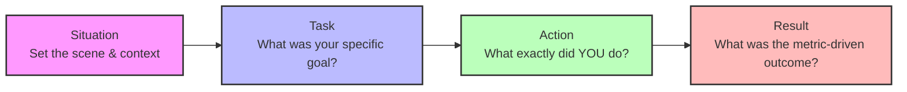

# Chapter: Behavioral Engineering & Soft Skills

## 1. Overview
The hardest problems in software engineering are rarely technical; they are human. 

You can be the most brilliant Edifecs architect in the world, capable of parsing 10GB X12 files in milliseconds. But if you are arrogant, refuse to document your code, attack colleagues during Code Reviews, and cannot explain your architectural decisions to non-technical business stakeholders, you are a net-negative to the company. 

**Behavioral Engineering** is the mastery of the "Soft Skills." It is the ability to navigate team conflict, receive critical feedback without ego, negotiate deadlines with product managers, and lead a team through a catastrophic production outage without assigning blame. Top-tier tech companies (FAANG) and massive healthcare enterprises weight behavioral interviews just as heavily as technical ones to weed out "toxic rockstars."

## 2. Why This Exists (The Cost of Toxicity)
Historically, the tech industry glorified the "Brilliant Jerk"—the lone-wolf programmer who lived in the basement, wrote incomprehensible code, but fixed every bug. 

**The Shift to Collaborative Engineering:**
Modern enterprise systems (like a Humana claims adjudication pipeline) are too massive for one person to understand. They require teams of dozens of engineers. 
If a team has a toxic rockstar who belittles junior engineers:
1. Juniors stop asking questions, leading to hidden bugs that crash production.
2. Code reviews become battlegrounds, slowing down deployment cycles.
3. Turnover spikes, and replacing a healthcare integration engineer costs a company tens of thousands of dollars in recruiting fees.

Behavioral interviews exist as a strict firewall to protect the company culture from these expensive failures.

## 3. Real World Analogy
**The Surgeon vs. The Surgical Team**

Imagine a world-class heart surgeon who screams at the nurses, ignores the anesthesiologist, and throws scalpels when stressed. While technically brilliant, the tension in the operating room causes a nurse to hesitate before pointing out a dropping heart rate, and the patient dies.

Now imagine a very good (but not world-famous) surgeon who fosters a calm, communicative environment where everyone feels safe speaking up. 

Modern engineering teams want the second surgeon. The goal is the survival of the patient (the production system), not the glorification of the surgeon.

## 4. Technical Definition
**Soft Skills** in engineering are the interpersonal, communication, and emotional intelligence competencies required to effectively navigate cross-functional teamwork, conflict resolution, technical consensus-building, and crisis management.

## 5. Internal Working (The Core Philosophies)

To pass behavioral interviews and thrive in enterprise engineering, you must internalize three philosophies:

1. **Ego-less Engineering:** You are not your code. When a Senior Architect says, "This Groovy script is unmaintainable," they are critiquing the logic, not insulting your intelligence. Separate your self-worth from your pull requests.
2. **Empirical Decision Making:** Never resolve architectural disputes with "Because I'm the Senior Engineer." Resolve them with data. If there is a debate over JSON mapping tools, build a prototype, run a benchmark, and let the execution time (TAT) make the decision.
3. **Disagree and Commit:** (An Amazon Leadership Principle). It is your duty to voice strong objections if you think an architecture is flawed. But once leadership makes the final decision, you drop your opposition and execute their plan with 100% effort, as if it were your own idea. No passive-aggressiveness.

## 6. Architecture (The Anatomy of a Behavioral Answer)

When asked a behavioral question in an interview, you must structure your answer using the **STAR Architecture**. If you do not use this structure, you will ramble and fail the interview.

## 7. Lifecycle (Handling a Production Outage)

How an engineer behaves during a crisis is the ultimate test of soft skills.

1. **Detection (The Alarm):** At 2:00 AM, the Edifecs server crashes. PagerDuty goes off.
2. **Triage (Focus):** You log into the bridge call. The business team is panicking. Your first job is *calm communication*. "I am looking at the JVM thread pool; give me 5 minutes."
3. **Mitigation (Stop the Bleeding):** The goal is not to find the perfect fix; the goal is to stop the damage. You rollback the deployment or truncate the massive log file.
4. **Resolution (The Fix):** You patch the code and deploy safely.
5. **Blameless Post-Mortem:** This is the most critical behavioral step. The next day, the team meets. You do not say, "Bob pushed a bad Groovy script." You say, "The deployment pipeline lacked an automated memory-leak check." You blame the *system*, not the *human*, and you build guardrails so Bob's mistake can never happen again.

## 8. Production Example

**Context:** The MapBuilder vs. Groovy Dispute

**Situation (S):** On a major State Medicaid project, we needed to transform an incoming 276 payload into a complex JSON schema for the CORE APIs. A senior engineer on my team wanted to write a highly customized, 1000-line Groovy script to parse the XML DOM manually because he felt Edifecs MapBuilder was "too rigid."

**Task (T):** I needed to ensure the solution was maintainable long-term. I knew a massive Groovy script would become unreadable technical debt for future junior engineers to maintain, but I couldn't just tell the Senior Engineer he was wrong.

**Action (A):** Instead of starting a philosophical argument, I used Empirical Decision Making. I spent four hours over the weekend building a functional prototype of the exact requirement using MapBuilder. I set up a meeting with him to demonstrate how MapBuilder handled conditional X12 segment looping natively, and more importantly, how it automatically threw standardized HIPAA errors if data types mismatched—something his Groovy script would require hundreds of extra lines to handle gracefully.

**Result (R):** By showing the prototype, I removed ego from the equation. He acknowledged the reduced technical debt and the native error handling. We went with the MapBuilder approach. Crucially, I learned a lot from his edge-case logic, which we incorporated into the MapBuilder rules. The final solution processed claims 20% faster and was easily readable by the junior team members.

## 9. Code Examples (The "Code" of Communication)

### Bad Code Review Feedback (Toxic)
> *"This Groovy script is terrible and completely inefficient. Why would you use a nested for-loop here? Rewrite it."*
*(Result: The junior engineer feels attacked, gets defensive, and becomes afraid to ask questions in the future.)*

### Good Code Review Feedback (Ego-less & Constructive)
> *"Great work getting the X12 parsing logic to pass the unit tests! I noticed we are using a nested for-loop on line 45. Since this payload can have up to 50,000 service lines, this might cause O(N^2) latency under load. What do you think about using a Hash Map lookup here instead? Happy to pair-program on it if you'd like!"*
*(Result: The junior engineer feels supported, learns a new optimization technique, and the code improves.)*

## 10. Best Practices

1. **Say "I don't know" Confidently:** If an interviewer asks you a deeply technical Edifecs C++ question you don't know, never lie or guess wildly. Say: *"I haven't encountered that specific memory edge-case before. However, if I faced it in production, my first step would be to pull a JVM thread dump via EAM, check the Edifecs documentation for that specific exception, and consult a senior architect."*
2. **Use "I" not "We" in STAR:** Interviewers want to know what *you* did. If you say "We built the API," the interviewer doesn't know if you architected the system or just watched someone else type. Say "My team owned the API. *My specific role* was to write the Groovy orchestrator."
3. **Listen Actively:** In technical interviews, if the interviewer drops a hint ("Are you sure a synchronous route is best here?"), do not stubbornly defend your first answer. Pause, acknowledge the hint, and adapt. ("That's a great point. If the backend is slow, synchronous would exhaust threads. I should use an async queue.")

## 11. Common Mistakes

1. **Rambling:** Answering a behavioral question by talking for 8 uninterrupted minutes. The interviewer stops listening after 2 minutes. Stick strictly to the STAR method and finish in 90 to 120 seconds.
2. **The Fake Weakness:** When asked, "What is your biggest weakness?", never say "I work too hard" or "I'm a perfectionist." It shows a lack of self-awareness. Give a real, technical/process weakness and show how you mitigate it. (e.g., *"I sometimes get tunnel vision when debugging complex Groovy scripts. I've learned to mitigate this by setting a 45-minute timer; if I haven't solved it, I force myself to stand up and ask a colleague for a fresh pair of eyes."*)
3. **Badmouthing Previous Employers:** Never say your last manager was an idiot or your last company was disorganized. It makes you sound toxic. Say, *"The engineering culture had differing views on agile processes, which is why I am looking for a team with strong CI/CD maturity like yours."*

## 12. Troubleshooting (When You Blank in an Interview)

**Symptom: The interviewer asks a question, and your mind goes completely blank.**
- *Root Cause:* Adrenaline and panic.
- *Solution:* Do not instantly start talking to fill the silence. It is 100% acceptable to say, *"That is a great question. Let me take 10 seconds to think of the best example for you."* Take a deep breath, mentally scan your projects (Humana, Colorado), formulate your STAR framework, and then speak.

## 13. Interview Questions

### Easy
**Q: Tell me about a time you had to learn a new technology quickly.**
> A: *[Use STAR]* When I started the Colorado project, I was strong in Java but had never used Edifecs MapBuilder. I volunteered to take a lower-priority mapping ticket, spent my weekend reading the Edifecs documentation, and shadowed a senior engineer for two hours. By week two, I was independently delivering complex XML-to-JSON maps.

### Medium
**Q: Tell me about a time you failed or made a major mistake.**
> A: *[Use STAR]* Early in my career, I deployed an updated SpecBuilder profile without fully testing the SNIP 2 downstream impacts. It passed the test cases but caused `NullPointerExceptions` in the production Facets database. *[The Fix]*: I immediately rolled back the deployment. *[The Lesson]*: I realized our testing data was too clean. I implemented a new QA process requiring "dirty data" negative testing before any profile deployment.

### Hard
**Q: You are leading an integration project. The Product Manager demands the API be live by Friday. You know the code is barely tested and will likely crash under load, but the PM says "We'll fix it later." How do you handle this?**
> A: *[Use STAR / Pushback]* I would rely on data, not emotion. I would run a quick SoapUI load test showing that the API fails at 10 requests/second. I would present this to the PM and explain the business impact: "If we launch Friday, the system will crash, providers won't get paid, and we will violate CAQH SLAs, causing massive reputational damage." I would then offer a compromise: "We can release a limited beta to 5% of providers on Friday, which the system can handle, giving engineering time to optimize the thread pools for the global launch next Wednesday."

### Scenario-Based
**Q: What would you do if a senior engineer consistently rejects your Pull Requests with vague, unhelpful comments like "This is wrong"?**
> A: I would assume positive intent—they might just be busy. I would not argue in the PR comments. Instead, I would set up a quick 15-minute 1-on-1 meeting. I would say, "I want to make sure my code meets your architectural standards. Can we walk through this PR together so I can understand the specific patterns you're looking for?" This moves the interaction from combative text to a collaborative conversation.

## 14. Comparison Table

| Trait | The "Brilliant Jerk" | The Senior Architect (Ideal) |
| :--- | :--- | :--- |
| **Code Review Style** | "This is garbage. Fix it." | "Great start. Let's optimize this loop." |
| **Outage Response** | "Who broke the server?" | "How do we fix the system?" |
| **Disagreements** | Argues until they win. | Uses data/prototypes to find the truth. |
| **When Overruled** | Complains and drags their feet. | Disagrees, but commits 100% to the plan. |
| **Knowledge Sharing** | Hoards knowledge for job security. | Mentors juniors constantly. |

## 15. Advanced Concepts

- **Psychological Safety:** A concept popularized by Google's Project Aristotle. It is the belief that you won't be punished or humiliated for speaking up with ideas, questions, concerns, or mistakes. High-performing teams have high psychological safety.
- **The "Bus Factor":** A morbid metric measuring how many team members would need to be hit by a bus before the project collapses. If one toxic rockstar hoards all the knowledge, the Bus Factor is 1 (Very Dangerous). Behavioral engineers actively document and cross-train to increase the Bus Factor.

## 16. Revision Cheat Sheet

*   **The Golden Rule:** The code is not you. Leave your ego at the door.
*   **The STAR Method:** **S**ituation, **T**ask, **A**ction (I did this), **R**esult (Metrics).
*   **Empirical Decisions:** Settle architectural disputes with data and prototypes, not titles and arguments.
*   **Disagree & Commit:** Voice objections clearly, but execute the final decision flawlessly.
*   **Blameless Post-Mortems:** Fix the system, don't hunt the human.
*   **The Real Weakness:** Always provide a real weakness AND the specific system you built to overcome it.
*   **Assuming Positive Intent:** In remote work, tone is easily lost in text. Assume your colleagues are trying to help, not attack.

## 17. References
- [Google's Project Aristotle (Effective Teams)](https://rework.withgoogle.com/print/guides/5721312655835136/)
- [Amazon Leadership Principles (Disagree & Commit)](https://www.aboutamazon.com/about-us/leadership-principles)
- [The STAR Interview Method](https://www.themuse.com/advice/star-interview-method)
