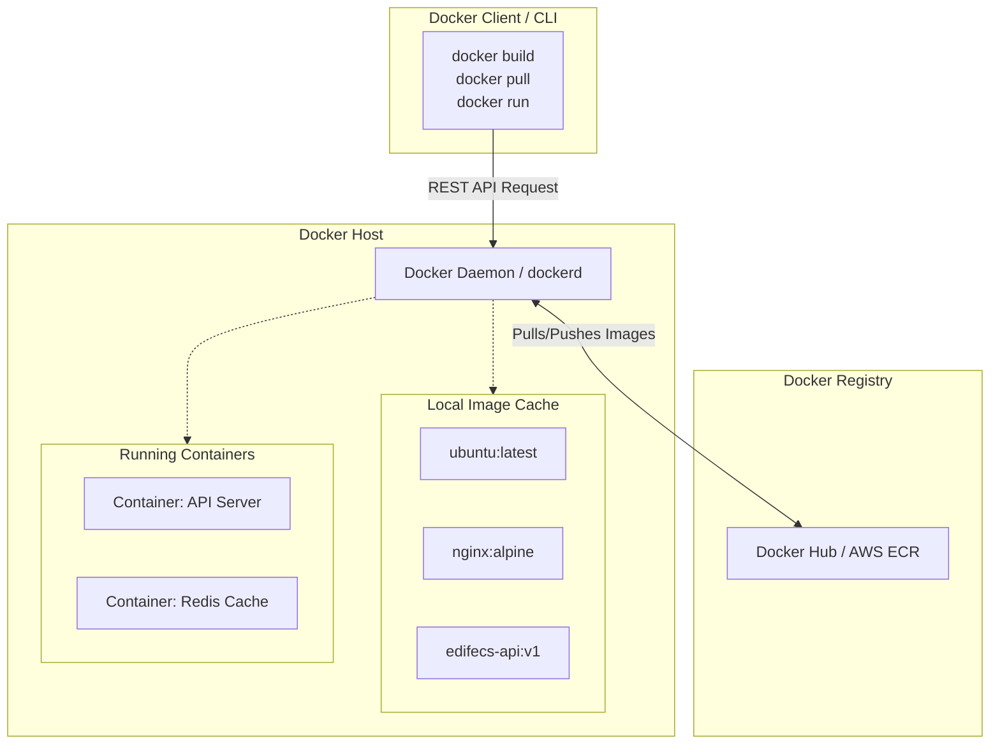

# Chapter: Docker & Containerization

## 1. Overview
Imagine buying a complex piece of furniture that requires twenty different screws, specialized tools, and exact environmental conditions to assemble. Now imagine if the manufacturer shipped the furniture already fully assembled inside an indestructible, lightweight, invisible box. Wherever you put that box—in your living room, on a truck, or in an office—the furniture works perfectly because the box contains everything it needs. 

Docker is that invisible box for software. It allows engineers to package an application along with all of its dependencies, libraries, configuration files, and even the specific version of the operating system it needs to run. This package, called a **Container**, can be executed on any computer that has Docker installed. Whether it is your local Windows laptop, a testing server, or a massive AWS cloud environment, the application will behave exactly the same way.

## 2. Why This Exists
Historically, deploying software was a nightmare characterized by the phrase: *"But it works on my machine!"*

**The Pre-Docker Era (Bare Metal & Virtual Machines):**
Before containers, applications were deployed directly onto physical servers (bare metal) or Virtual Machines (VMs). 
1. **Dependency Hell**: If an Associate Implementation Consultant built an Edifecs X12 translation tool using Java 11 on their laptop, but the production server was running Java 8, the application would crash.
2. **Resource Waste**: To solve dependency conflicts, engineers used VMs. They would spin up a separate VM for the database, another for the API, and another for the UI. However, every VM requires a complete, heavy guest operating system (OS). If you have three apps, you are running three entire operating systems, consuming massive amounts of RAM and CPU just to keep the OS alive, leaving little room for the actual applications.
3. **Slow Boot Times**: Starting a VM takes minutes because an entire OS must boot up.

Docker was invented to solve these specific pain points. It introduced a way to achieve the isolation of a Virtual Machine without the immense resource overhead of running a full Guest OS.

## 3. Real World Analogy
**The Shipping Industry (The Origin of "Containers")**

Before the 1950s, global shipping was chaotic. You would load barrels of oil, sacks of flour, and crates of machinery individually onto a ship. Unloading took days. Different trucks were needed for different goods.

Then, the world invented the **Standardized Shipping Container**. It didn't matter if you were shipping cars, healthcare supplies, or electronics. You packed them into the exact same 20-foot steel box. The cranes didn't need to know what was inside; they only needed to know how to lift a standard box. The trucks didn't care what was inside; they just needed to carry the box.

Docker is the standardized shipping container for code. The host server (the crane/truck) doesn't care if it's running a Python API, a PostgreSQL database, or an Edifecs processing engine. It just runs the standard "Docker Container."

## 4. Technical Definition
**Docker** is an open-source platform designed to automate the deployment, scaling, and management of applications using containerization. It utilizes OS-level virtualization to deliver software in standardized packages called containers.

**Containers** are isolated, ephemeral environments that share the host machine's Operating System kernel but encapsulate the application process, its filesystem, networking stack, and resource limitations.

## 5. Internal Working
Docker is not "magic"—it is heavily reliant on three native Linux kernel features. When you run a Docker container, Docker is simply asking the Linux kernel to apply these three constraints to a specific process:

1. **Namespaces (Isolation):**
   Namespaces restrict what a process can *see*. When Docker starts an application, it puts it in a separate namespace. 
   - *PID Namespace*: The container thinks it has Process ID 1. It cannot see any processes running on the host machine.
   - *Net Namespace*: The container gets its own isolated network stack and IP address.
   - *Mnt Namespace*: The container is given a distinct file system tree. It cannot see the host's `C:\` or `/` drive.

2. **cgroups (Control Groups) (Resource Limitation):**
   cgroups restrict what a process can *use*. Without cgroups, a containerized application with a memory leak could consume 100% of the host server's RAM, crashing everything else. Docker uses cgroups to say, "This specific container is only allowed to use 512MB of RAM and 1 CPU core."

3. **Union File Systems (UFS) (Efficiency):**
   Docker Images are built in *layers*. If you have 10 containers all running Ubuntu, Docker doesn't copy the 500MB Ubuntu OS 10 times. UFS allows multiple containers to share the exact same read-only underlying layers (like the base OS) on disk, and only adds a tiny read/write layer on top for each specific container's unique data.

## 6. Architecture



### Component Breakdown:
- **Docker Client:** The CLI tool where you type commands (e.g., your terminal). It communicates via a REST API to the Daemon.
- **Docker Daemon (`dockerd`):** The brain of Docker running in the background of the host server. It listens for API requests and manages images, containers, networks, and volumes.
- **Docker Registry:** A centralized repository for storing Docker Images. Docker Hub is public; AWS ECR or Azure ACR are private enterprise registries.
- **Docker Image:** A read-only template with instructions for creating a Docker container (like a Java Class).
- **Docker Container:** A runnable instance of an image (like a Java Object).

## 7. Lifecycle

The complete lifecycle of a container application involves several distinct phases:

1. **Creation (Dockerfile):** You write a `Dockerfile`, which is a text script containing instructions on how to build your application environment.
2. **Build (`docker build`):** The Daemon reads the Dockerfile and compiles it into a static, read-only **Image**.
3. **Distribution (`docker push / pull`):** The Image is pushed to a Registry (like AWS ECR) so other servers can download it.
4. **Execution (`docker run`):** The Daemon takes the Image, adds a read-write layer on top, sets up the network namespaces, and starts the container process.
5. **Pause/Unpause (`docker pause`):** The container's processes are frozen using cgroups. It remains in memory but consumes zero CPU.
6. **Failure/Restart:** If the main application process (PID 1) crashes, the container stops. Based on restart policies (`--restart always`), Docker may automatically recreate it.
7. **Deletion (`docker rm`):** The container is permanently deleted. Because containers are ephemeral, **all internal data is destroyed** unless mounted to an external Volume.

## 8. Production Example

**Context:** Healthcare Integration Engineering (Edifecs / X12)

Consider a modern healthcare architecture receiving HIPAA-compliant X12 837 (Claims) files via SFTP. 
Traditionally, an integration team might install a massive monolithic Edifecs processing engine on a single Windows Server. If the engine needs to be upgraded, the entire system incurs downtime. If a rogue EDI file causes a memory leak during parsing, the entire server crashes, halting all claims processing.

**The Containerized Solution:**
Instead, we containerize the architecture into microservices:
1. **SFTP Receiver Container:** Simply receives files and pushes them to an Amazon SQS queue. 
2. **X12 Parser Containers (x5):** We run five identical, isolated containers whose sole job is to pull from SQS and translate X12 837 files into JSON. They are built from a customized Linux image containing the exact version of Java required by the translation logic.
3. **Database Container:** A PostgreSQL instance storing the parsed metadata.

If a massive batch of 100,000 claims arrives, the system orchestrator (like Kubernetes) can automatically tell Docker to spin up 20 more "X12 Parser Containers" in seconds. If one parser container crashes due to a malformed X12 file, only that specific container dies and is instantly replaced, while the other 24 continue processing claims seamlessly. HIPAA compliance is maintained because the host OS is completely decoupled from the application logic.

## 9. Code Examples

### 1. The Dockerfile
The blueprint for our Image.

```dockerfile
# 1. Start from a lightweight base image to reduce surface area and size
FROM node:18-alpine 

# 2. Set the working directory inside the container
WORKDIR /usr/src/app

# 3. Copy ONLY the package.json first. 
# Why? Docker caches layers. If we only change source code, Docker won't redownload all npm packages.
COPY package*.json ./

# 4. Install dependencies
RUN npm install --production

# 5. Copy the rest of our application code into the container
COPY . .

# 6. Expose the port the app runs on (Documentation only, does not publish the port)
EXPOSE 3000

# 7. Define the default command to run when the container starts. This becomes PID 1.
CMD ["node", "server.js"]
```

### 2. Building and Running (CLI)
```bash
# Build the image and tag it as 'healthcare-api'
docker build -t healthcare-api:v1 .

# Run the container in the background (-d), map host port 80 to container port 3000 (-p)
# Name it 'api-prod' for easy management
docker run -d --name api-prod -p 80:3000 healthcare-api:v1

# View logs to ensure it started correctly
docker logs -f api-prod
```

### 3. Docker Compose
Used to define and run multi-container applications locally. (Saved as `docker-compose.yml`)

```yaml
version: '3.8'
services:
  api:
    image: healthcare-api:v1
    ports:
      - "80:3000"
    environment:
      - DB_HOST=postgres-db # Automatically resolves to the database container IP via Docker DNS!
    depends_on:
      - postgres-db
      
  postgres-db:
    image: postgres:14-alpine
    environment:
      - POSTGRES_PASSWORD=securepassword
    volumes:
      - pgdata:/var/lib/postgresql/data # Persist data outside the ephemeral container

volumes:
  pgdata: # Define the named volume
```

## 10. Best Practices

1. **Use Multi-Stage Builds:** When compiling languages like Java or Go, use one container layer with the massive JDK installed to compile the code, and a second, tiny container layer (like `alpine`) to actually run the compiled binary. This reduces image sizes from 1GB to 50MB.
2. **Never Run as Root:** By default, containers run as the root user. If a hacker breaches the application, they have root access to the container, and potentially the host kernel. Always create a restricted user in your Dockerfile (`USER appuser`).
3. **One Process Per Container:** Do not try to run Apache, MySQL, and Redis all inside one container. A container should have a single responsibility. This makes scaling and debugging drastically easier.
4. **Leverage `.dockerignore`:** Similar to `.gitignore`, this prevents large or sensitive files (like `node_modules` or `.env` files with passwords) from being copied into the final Image.

## 11. Common Mistakes

1. **Assuming Data is Persistent:** Beginners often run a database container, add data, and are shocked when the container restarts and the database is completely empty. **Containers are ephemeral**. You must use Docker Volumes (`-v`) to persist data to the host machine's physical hard drive.
2. **Zombie Processes (The PID 1 Problem):** If your Dockerfile ends with a shell script wrapper (e.g., `CMD ["./start.sh"]`), that script becomes Process ID 1. If the app inside the script crashes, the script (PID 1) might stay alive, meaning Docker thinks the container is healthy even though the app is dead. Ensure the application itself is PID 1, or use tools like `dumb-init`.
3. **Baking Secrets into Images:** Never put API keys, DB passwords, or SSH keys in a Dockerfile. Anyone who pulls the image can extract them. Pass secrets at runtime via Environment Variables (`-e`) or secret managers.
4. **Using the `:latest` Tag in Production:** If you deploy `ubuntu:latest`, it might be Ubuntu 20.04 today and Ubuntu 22.04 tomorrow. This destroys the "It works anywhere exactly the same" guarantee. Always pin specific versions (e.g., `postgres:14.2-alpine`).

## 12. Troubleshooting

**Symptom 1: Container instantly exits after starting.**
- *Root Cause:* A container only stays alive as long as its main foreground process (PID 1) is running. If you run a background service (like `service nginx start` instead of `nginx -g 'daemon off;'`), the command finishes, PID 1 exits, and Docker terminates the container.
- *Solution:* Ensure your `CMD` directive runs a blocking, foreground process. Check `docker logs <id>`.

**Symptom 2: "Cannot connect to database" (Locally works, Docker fails).**
- *Root Cause:* Network isolation. Inside a Docker container, `localhost` means the container itself, not your laptop. If your database is running on your laptop, the container cannot reach it via `localhost`.
- *Solution:* If using Docker Compose, use the service name (e.g., `http://database-service:5432`). If hitting a local process from a container, use special internal DNS like `host.docker.internal`.

**Symptom 3: Host server disk is 100% full.**
- *Root Cause:* Every time you build an image, old layers stick around as "dangling images". Stopped containers and old networks accumulate.
- *Solution:* Run `docker system prune -a` to aggressively clean up unused Docker assets.

**Symptom 4: OOMKilled (Out of Memory).**
- *Root Cause:* The application tried to use more RAM than the cgroups limit allowed. The Linux kernel's OOM killer forcefully terminated the process.
- *Solution:* Run `docker inspect <container_id>` and look for `"OOMKilled": true`. Increase the container memory limits, or fix the memory leak in the application code.

## 13. Interview Questions

### Easy
**Q: What is the difference between a Docker Image and a Docker Container?**
> A: An Image is a static, read-only blueprint containing the application code and environment (like an OOP Class). A Container is the active, running instantiation of that Image (like an OOP Object).

### Medium
**Q: How do you persist data if a container is ephemeral?**
> A: By using Docker Volumes. Volumes map a directory inside the container's isolated file system to a physical directory on the host server's hard drive. When the container dies, the data remains safely on the host.

### Hard
**Q: Explain how Docker achieves isolation without a hypervisor.**
> A: Docker does not use a hypervisor because it does not virtualize hardware. Instead, it relies on Linux kernel features. It uses **Namespaces** to isolate what a process can see (network, PIDs, mounts) and **cgroups** to restrict what a process can use (CPU, Memory).

### Scenario-Based
**Q: You are brought in to consult for an Edifecs implementation team. Their integration server is crashing nightly. They deploy everything via a massive `docker-compose.yml` file. You look at the server and see CPU usage at 100%. How do you troubleshoot this live?**
> A: 
> 1. First, I would run `docker stats` to get a live, top-like view of all running containers to identify exactly which container is consuming the CPU.
> 2. Once identified (e.g., the `x12-translator` container), I would check its logs using `docker logs --tail 100 x12-translator` to look for infinite loops, stack traces, or massive file ingestion events.
> 3. If the logs are inconclusive, I would drop a shell into the running container using `docker exec -it x12-translator /bin/sh` and run native Linux debugging tools (`top`, `ps`) to identify the exact rogue thread or process.
> 4. Long term, I would implement cgroups limits in the `docker-compose.yml` (`deploy.resources.limits.cpus`) so that even if the translator goes rogue, it is throttled and cannot crash the host server.

### Architectural / Behavioral
**Q: Why shouldn't you run a database inside a Docker container in production?**
> *Note: This is a classic trap question. It is highly debated.*
> A: While running stateful databases (Postgres, Oracle) in Docker is fine for local development, doing so in production introduces immense risk. Databases require high I/O performance and absolute data durability. While Docker Volumes solve data persistence, managing database backups, replication, disaster recovery, and kernel-level IO tuning is exceedingly complex inside containers. For production, it is almost universally better to use managed cloud services (like AWS RDS) for databases, and reserve containers exclusively for stateless application logic.

## 14. Comparison Table

| Feature | Virtual Machines (VMs) | Docker Containers |
| :--- | :--- | :--- |
| **Architecture** | Hardware-level virtualization (Hypervisor). | OS-level virtualization (Namespaces/cgroups). |
| **Guest OS** | Requires a full OS for every VM (Heavy). | Shares the Host OS kernel (Lightweight). |
| **Boot Time** | Minutes (must boot an entire operating system). | Milliseconds (just starting a standard process). |
| **Size** | Gigabytes per VM. | Megabytes per Container. |
| **Isolation** | Perfect security isolation. | Strong, but theoretically vulnerable to kernel exploits. |
| **Best Use Case** | Running fundamentally different operating systems (Windows on Linux). | Microservices, CI/CD pipelines, stateless APIs. |

## 15. Advanced Concepts

- **Docker-in-Docker (DinD):** Running a Docker daemon inside a Docker container. Highly complex, primarily used in CI/CD runners (like GitLab CI) to build Docker images securely without exposing the host's daemon.
- **eBPF (Extended Berkeley Packet Filter):** An advanced kernel technology increasingly used instead of standard iptables to manage networking and security observability for containerized microservices at blazing speeds.
- **Container Orchestration:** Docker on a single machine is easy. Managing 5,000 Docker containers across 100 physical servers is impossible manually. This is where orchestrators like **Kubernetes (K8s)** or Docker Swarm step in, handling automated rollouts, self-healing, and load balancing across vast container clusters.

## 16. Revision Cheat Sheet

*   **Docker:** Standardized shipping box for code. Solves "It works on my machine."
*   **Image vs Container:** Image = Read-only Blueprint. Container = Running Instance.
*   **Volumes:** How you save data. Maps container folder to host folder.
*   **How it works:** 
    *   **Namespaces:** Isolation (Network, PID). What the app can *see*.
    *   **cgroups:** Resource Limits (RAM, CPU). What the app can *use*.
    *   **UFS:** Layered file system for fast, efficient storage sharing.
*   **VM vs Docker:** VMs virtualize hardware (heavy OS). Docker virtualizes the OS (shares host kernel, fast).
*   **The PID 1 Rule:** The container lives only as long as its main foreground process lives.
*   **Networking trap:** `localhost` inside a container means the container itself, not the host machine.
*   **Must-know commands:** `docker build`, `docker run`, `docker exec -it <id> /bin/sh`, `docker logs`, `docker system prune`.

## 17. References
- [Official Docker Documentation](https://docs.docker.com/)
- [Docker Architecture Overview](https://docs.docker.com/get-started/overview/#docker-architecture)
- [Namespaces in Linux (Man pages)](https://man7.org/linux/man-pages/man7/namespaces.7.html)
- [Best Practices for writing Dockerfiles](https://docs.docker.com/develop/develop-images/dockerfile_best-practices/)
