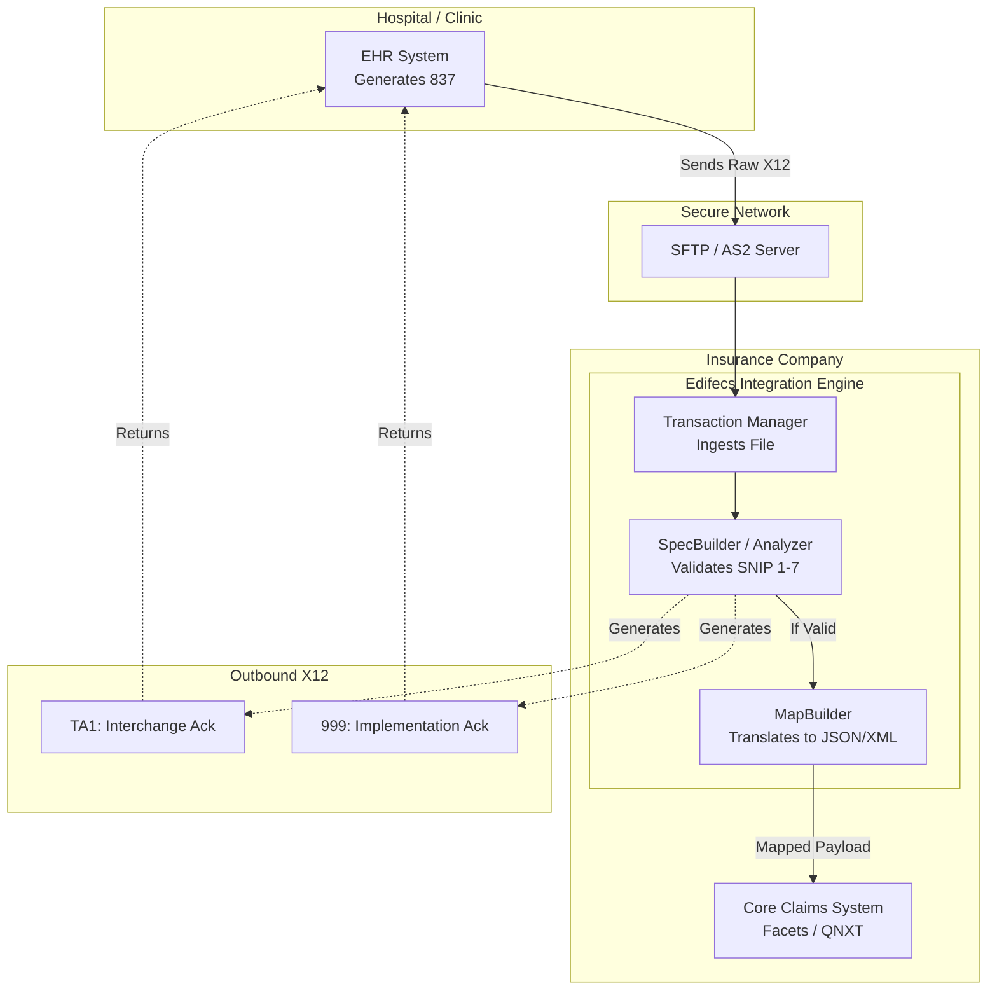

# Chapter: Healthcare EDI & ANSI X12

## 1. Overview
Imagine trying to process a million medical claims a day. If every hospital sent their bills in a different format—some using Excel, some using PDFs, some using handwritten letters in English, and others in Spanish—the insurance company would need an army of humans just to read and translate the data. 

**Electronic Data Interchange (EDI)** is the solution to this chaos. It is a standardized digital language that allows different computer systems to talk to each other without human intervention. In the US healthcare system, the specific dialect of EDI that everyone is legally mandated to use is called **ANSI ASC X12**. Thanks to EDI, a hospital's billing software can automatically send a massive file containing thousands of claims to an insurance company's servers, and the servers can process it in seconds because they both speak the exact same structured language.

## 2. Why This Exists
Historically, healthcare administration was an ocean of paper.

**The Pre-EDI Era:**
1. **The Cost of Paper**: In the 1980s, processing a single paper claim cost an insurance company over $15 in administrative overhead. Someone had to open the mail, read the paper form, manually type the data into a mainframe, and mail back a paper check.
2. **Massive Error Rates**: Manual data entry resulted in massive typographic errors. A typo on a member ID meant the claim was denied, leading to angry phone calls and weeks of delays.
3. **The Tower of Babel**: Early attempts at digitization were chaotic. Hospital A sent comma-separated files (`.csv`), while Hospital B sent fixed-length text files. Payers had to write thousands of custom integration scripts.

**The HIPAA Mandate:**
In 1996, the US Government passed the Health Insurance Portability and Accountability Act (HIPAA). To force efficiency and standardization, HIPAA legally mandated that all healthcare entities (Providers, Payers, and Clearinghouses) must use the **X12 standard** for administrative transactions. It solved the Tower of Babel problem by law.

## 3. Real World Analogy
**The Universal Tax Form**

If you want to tell the government how much money you made, you cannot just write them a letter on notebook paper saying, "I made $50,000 this year, here is my money." The IRS would reject it. 

Instead, you must fill out a **W-2** or a **1040** form. Box 1 is strictly for Wages. Box 2 is strictly for Federal Income Tax Withheld. Because everyone uses the exact same form, the IRS's computers can automatically scan millions of returns instantly. 

EDI X12 is the "universal tax form" for healthcare data. Instead of boxes on a paper, it uses standardized "Segments" and "Elements" in a text file.

## 4. Technical Definition
**EDI (Electronic Data Interchange)** is the computer-to-computer exchange of business documents in a standard electronic format between business partners.

**ANSI ASC X12** (American National Standards Institute, Accredited Standards Committee X12) is the official standard for EDI used in the United States. In healthcare, specific "Transaction Sets" are defined by HIPAA (e.g., the 837 for Claims, the 835 for Remittances, the 270/271 for Eligibility).

## 5. Internal Working
An X12 file is a highly structured, hierarchical text file. It is not JSON, and it is not XML. It is a string of characters separated by special delimiters. 

### The Delimiters
To keep files small, X12 uses delimiters instead of verbose tags.
- **Segment Terminator (usually `~`)**: Marks the end of a line/segment.
- **Data Element Separator (usually `*`)**: Separates individual pieces of data within a segment.

### The Envelope Structure (The Russian Nesting Dolls)
An X12 file is structured like a letter inside an envelope, inside a bigger envelope, inside a shipping box.

1. **ISA / IEA (Interchange Control Envelope)**: The outermost box. It acts like the shipping label on a FedEx package. It identifies the physical Sender and physical Receiver.
2. **GS / GE (Functional Group Envelope)**: Inside the shipping box, you might have batches. For example, a batch of Claims and a batch of Payments. The GS groups similar transactions together.
3. **ST / SE (Transaction Set)**: The actual document itself (e.g., a single 837 Claim file).
4. **Segments**: Lines of data inside the transaction (e.g., `NM1` for a Name).
5. **Elements**: The specific data fields (e.g., `Smith`, `John`).

## 6. Architecture

This diagram illustrates how EDI flows between entities and is parsed by an engine (like Edifecs).



### Component Breakdown:
- **EHR**: Electronic Health Record (Epic, Cerner) creates the raw X12 text file.
- **Transport**: X12 contains Protected Health Information (PHI). It is never sent via regular email or HTTP. It uses encrypted SFTP or AS2.
- **Edifecs Analyzer**: The validation engine. It reads the X12 and ensures it perfectly matches HIPAA rules.
- **Edifecs MapBuilder**: X12 is hard for modern databases to read. The Mapper translates the valid X12 string into a modern format like JSON or XML for the backend systems.

## 7. Lifecycle

1. **Generation:** A hospital's billing system compiles patient visits for the day and generates an 837 X12 file.
2. **Transmission:** The file is securely uploaded via SFTP to the Insurance Company (Payer).
3. **Parsing & De-enveloping:** The Payer's integration engine (e.g., Edifecs) opens the `ISA` envelope to see who sent it.
4. **Validation (SNIP Levels):** The engine checks the file against 7 levels of WEDI SNIP rules (Syntax, HIPAA rules, Balancing, etc.).
5. **Acknowledgment:** 
   - If the `ISA` envelope is fundamentally broken, it generates a **TA1** rejection.
   - For the payload itself, it generates a **999** Acknowledgment, telling the provider "We accepted your claim" or "We rejected it on Line 45 due to a missing Zip Code."
6. **Translation & Processing:** The valid X12 is converted to JSON and sent to the core adjudication system to decide how much money to pay the hospital.

## 8. Production Example

**Context:** State of Colorado Medicaid Integration

Consider a massive Medicaid system receiving thousands of 837 claims daily. 
When a claim arrives, the Edifecs engine processes it. Let's say a provider sends a claim for a patient, but forgets to include the patient's Date of Birth (DOB). 

According to HIPAA rules, the `DMG` (Demographic) segment is mandatory if the patient is a subscriber. 
1. The Edifecs Analyzer scans the file. It hits a **SNIP Type 2 (HIPAA Requirement)** violation because the DOB element is empty.
2. The Analyzer immediately halts processing for that specific claim to prevent bad data from crashing the backend database (which expects a valid Date object).
3. The engine automatically generates a **999 Implementation Acknowledgment**. Inside the 999, an `IK4` segment is created that explicitly states: *"Data Element DMG02 (Date of Birth) is missing."*
4. The 999 is sent back via SFTP to the provider. The provider fixes the DOB in their system and resubmits the claim the next day.

This automated validation prevents thousands of hours of manual human phone calls ("Hey, you forgot the DOB").

## 9. Code Examples

### Analyzing a Raw X12 Snippet

This is what a real EDI payload looks like. It is extremely dense.

```text
ISA*00*          *00*          *ZZ*SUBMITTERID    *ZZ*RECEIVERID     *230702*1200*^*00501*000000001*0*T*:~
GS*HC*SUBMITTERID*RECEIVERID*20230702*1200*1*X*005010X222A1~
ST*837*0001*005010X222A1~
BHT*0019*00*123456789*20230702*1200*CH~
NM1*85*2*HOSPITAL INC*****XX*1234567890~
N3*123 MAIN ST~
N4*DENVER*CO*80202~
SE*7*0001~
GE*1*1~
IEA*1*000000001~
```

**Line-by-Line Breakdown:**
- `ISA*...~`: The Interchange Envelope. Indicates `SUBMITTERID` is sending to `RECEIVERID`.
- `GS*HC...~`: The Group Envelope. `HC` indicates this batch contains Health Care Claims.
- `ST*837...~`: Start of the Transaction. `837` defines this as a Claim document.
- `BHT*...~`: Beginning of Hierarchical Transaction. Contains the batch reference number (`123456789`).
- `NM1*85*2*HOSPITAL INC...~`: Name Segment. `85` means Billing Provider. `2` means it's a Business (not a person). The NPI is `1234567890`.
- `N3*123 MAIN ST~`: Street Address Segment.
- `N4*DENVER*CO*80202~`: City, State, Zip Segment.
- `SE*7*0001~`: Transaction End. `7` means there were 7 segments between ST and SE.
- `GE*1*1~`: Group End.
- `IEA*1*000000001~`: Interchange End.

## 10. Best Practices

1. **Strictly Enforce SNIP Levels 1 and 2**: SNIP 1 (Syntax) and SNIP 2 (HIPAA Structure) should never be bypassed. If you allow fundamentally broken structure into your mapping layer, you will cause catastrophic NullPointerExceptions or data corruption in your backend.
2. **Always Archive Raw Payloads**: Before translating X12 to JSON, save the raw, unmodified X12 string in an archive database or AWS S3. If a legal dispute arises about what was actually billed, the raw X12 is the legally binding document.
3. **Use Robust Acknowledgment Tracking**: Never silently drop a file. Every `ISA` received must generate a `TA1` or a `999`. If a provider doesn't receive a 999, they will assume the file was lost and resubmit it, causing duplicate claim issues.

## 11. Common Mistakes

1. **Blindly Relaxing SNIP Rules**: A major trading partner might complain that their claims are rejecting. A junior engineer might log into SpecBuilder and change a mandatory segment to "Optional" just to make the partner happy. **Why this is wrong:** The downstream database schema still requires that data. The claim will pass the Edifecs engine but crash the Facets/QNXT database, requiring manual database cleanup. 
2. **Hardcoding Delimiters in Code**: Never write logic like `line.split("*")`. While `*` and `~` are standard, the ISA header explicitly defines the delimiters used for that specific file. A trading partner is legally allowed to use `|` instead of `*`. Your integration code must read the ISA segment to dynamically determine the delimiters.
3. **Losing the Hierarchical Context**: X12 uses "Loops" (like the 2000A Billing Provider loop vs the 2000B Subscriber loop). Both loops use the exact same `NM1` segment. Beginners often write naive regex to search for `NM1`, pulling the wrong name entirely because they didn't track which loop they were currently inside.

## 12. Troubleshooting

**Symptom 1: A massive batch file is rejecting completely, but the sender swears it's valid.**
- *Root Cause:* Check the **TA1** Acknowledgment. This is almost always an Interchange (ISA) error. The Sender ID or Receiver ID in the ISA header does not match your authorized trading partner list, or they used an invalid test/production indicator (`T` vs `P`).
- *Solution:* Update the Trading Partner configuration in your EDI gateway (like Edifecs Transaction Manager) to authorize their specific Sender ID.

**Symptom 2: Downstream JSON translator throws `IndexOutOfBoundsException` on an element.**
- *Root Cause:* The translator expected `NM1*85*2*HOSPITAL` and tried to read element index 3. However, the sender sent `NM1*85*2~` (missing elements at the end of the line). X12 allows dropping trailing empty elements to save space. 
- *Solution:* Fix the mapping logic. Never assume an element exists just because the segment exists. Use conditional `If-Exists` logic in MapBuilder.

**Symptom 3: Finding exactly what went wrong from a 999.**
- *Root Cause/Solution:* Open the 999. Find the `IK3` segment. It tells you the exact Segment Name (e.g., `N4`) and the exact Line Number in the original file. The following `IK4` segment tells you the specific Element Index and an error code (e.g., `1` for Mandatory data missing, `4` for Data element too short).

## 13. Interview Questions

### Easy
**Q: What is the purpose of the ISA and GS segments?**
> A: They act as the envelopes for the file. The ISA (Interchange) identifies the physical sender and receiver for routing. The GS (Group) batches similar transactions together (e.g., all 837 claims in one group).

### Medium
**Q: What is the difference between a TA1 and a 999 Acknowledgment?**
> A: A TA1 validates the outermost ISA envelope—it checks if we even know who the sender is. If the TA1 fails, the entire file is rejected instantly. A 999 is an Implementation Acknowledgment—it validates the actual business data (SNIP 1 and 2) inside the transaction and can reject specific claims while accepting others in the same batch.

### Hard
**Q: An 837 file is failing at SNIP Level 2 but passing SNIP Level 1. What does that mean and how do you fix it?**
> A: Passing SNIP 1 means the fundamental syntax (delimiters, segment lengths) is valid. Failing SNIP 2 means it violates a HIPAA Implementation Guide rule (e.g., a conditionally mandatory segment is missing, or a code value is invalid). I would review the generated 999 file, read the IK3/IK4 segments to pinpoint the exact line and element causing the failure, and then determine if the sender needs to fix their payload or if we need to adjust our profile logic in SpecBuilder.

### Scenario-Based
**Q: A critical hospital partner is sending claims where the N4 City segment is missing. HIPAA requires it, so Edifecs is rejecting them with a 999. The business team demands you let the files through immediately to pay the hospital. What is your architectural response?**
> A: While I *can* relax the SNIP 2 rule in SpecBuilder to make the `N4` segment optional, I must warn the business team about downstream impacts. If our core adjudication system (e.g., Facets) or our MapBuilder logic expects a City for tax calculations, passing the file will cause a catastrophic backend failure. I would agree to relax the rule *only if* we simultaneously implement mapping logic to inject a default "UNKNOWN" City value, shielding the backend from null data. 

## 14. Comparison Table

| Feature | ANSI X12 | JSON / REST APIs |
| :--- | :--- | :--- |
| **Structure** | Delimited text, highly hierarchical, strict rules. | Key-Value pairs, nested objects, highly flexible. |
| **Size/Efficiency** | Extremely compact (minimal overhead). | Verbose (keys are repeated for every record). |
| **Readability** | Almost unreadable without a manual/parser. | Highly human-readable. |
| **Transmission** | Batch processing via SFTP/AS2 (Asynchronous). | Real-time processing via HTTP (Synchronous). |
| **Primary Use Case** | Moving millions of massive healthcare/financial records at night. | Modern mobile apps, real-time single-record queries. |

## 15. Advanced Concepts

- **WEDI SNIP Levels 3 through 7:** While SNIP 1 and 2 are structural, higher levels are deeply complex. SNIP 3 balances amounts (Total Claim Amount must equal the sum of all Service Lines). SNIP 4 checks against national external databases (e.g., ensuring a ZIP code actually exists, or checking valid ICD-10 diagnosis codes).
- **HL7 FHIR (Fast Healthcare Interoperability Resources):** The modern API-based alternative to EDI. While EDI is king for massive backend billing batches, FHIR uses REST and JSON to allow real-time access to single patient records, bridging the gap between old EDI mainframes and modern mobile applications.

## 16. Revision Cheat Sheet

*   **EDI / X12:** The legal, standardized digital language for US healthcare (HIPAA mandate). Replaces paper.
*   **Structure:** Delimiters (`*`, `~`) instead of XML tags. Extremely compact.
*   **Envelopes:** 
    *   **ISA:** Outer envelope (Sender/Receiver routing). Generates **TA1** ack.
    *   **GS:** Inner batch envelope.
    *   **ST:** The actual document (e.g., 837). Generates **999** ack.
*   **SNIP Levels:** 
    *   **Level 1:** Syntax (Are the asterisks right?)
    *   **Level 2:** HIPAA Rules (Is the mandatory data present?)
*   **The Trap:** Never hardcode delimiters. Never relax SNIP rules without checking downstream impact.

## 17. References
- [X12 Official Website](https://x12.org/)
- [WEDI SNIP Guidance](https://www.wedi.org/)
- [Edifecs Documentation (Transaction Manager & SpecBuilder)](https://www.edifecs.com/)
- [CMS HIPAA Transaction Standard Information](https://www.cms.gov/Regulations-and-Guidance/Administrative-Simplification/HIPAA-ACA/Standards)
