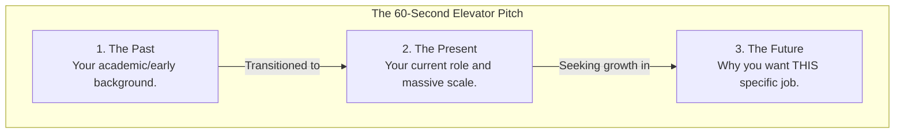

# Chapter: HR & Recruiter Navigation

## 1. Overview
The biggest mistake engineers make is assuming the HR/Recruiter round is just a formality. It is not. 

The recruiter is the gatekeeper. They do not care how well you can tune a Java garbage collector or how beautifully you mapped an X12 837 file. Their job is to protect the company from three specific risks: 
1. **The Flight Risk:** Will you leave the company in 6 months?
2. **The Budget Risk:** Are you going to demand $50,000 more than they are allowed to pay?
3. **The Toxicity Risk:** Are you going to ruin the team's culture?

If you fail to mitigate these three risks, the recruiter will reject you before you ever get a chance to speak to an engineering manager.

## 2. Why This Exists (The Cost of Hiring)
Historically, hiring was seen as a simple exchange of labor for money. 
Modern enterprise hiring is an incredibly expensive risk-management exercise. 

It costs a company roughly 30% to 50% of an engineer's first-year salary just to recruit and onboard them (headhunter fees, HR time, training, lost productivity of the senior engineers mentoring them). If they hire an engineer who quits after 4 months because "the culture wasn't a fit," the company loses massive amounts of money.

HR rounds exist to ensure the company's massive financial investment in *you* yields a long-term return.

## 3. Real World Analogy
**The Bouncer vs. The VIP Manager**

- **The Technical Interviewer:** The VIP Manager. They want to know if you have the skills and money to sit at the high-roller table.
- **The Recruiter/HR:** The Bouncer at the front door. The Bouncer doesn't care how rich you are or how good you are at poker. The Bouncer is just checking if you're wearing the right shoes, if you're sober, and if you're going to start a fight. You have to pass the Bouncer to meet the VIP Manager.

## 4. Technical Definition
The **HR Screen** is a behavioral and logistical evaluation designed to assess a candidate's communication skills, salary expectations, timeline, cultural alignment, and underlying motivations for seeking new employment.

## 5. Internal Working (The Recruiter's Scorecard)

Behind the scenes, the recruiter is filling out a mental (or literal) scorecard while you talk:
- **Clarity:** Can this person explain what they do concisely? (If they ramble for 5 minutes about a Groovy script, they fail).
- **Motivation:** Are they running *away* from a bad job, or running *towards* a new opportunity?
- **Compensation:** Are their salary expectations within the approved band for this requisition?
- **Timeline:** Can they start in 2 weeks, or do they need 3 months?

## 6. Architecture (The Anatomy of the Elevator Pitch)

The very first question you will be asked is: *"Tell me about yourself."* 
You must structure your response like a 60-second architectural diagram.

## 7. Lifecycle (Navigating the Salary Trap)

The most dangerous part of the HR lifecycle is the Salary Negotiation. 

1. **The Trap:** The recruiter asks, "What are your salary expectations?" early in the call.
2. **The Mistake:** You give a specific number (e.g., "$130,000").
    - If their budget is $100k, you are instantly disqualified.
    - If their budget is $170k, you just lost $40,000 a year because you anchored low.
3. **The Deflection:** "I'm currently focused on finding a role where I can grow my cloud architecture skills, like this one. I am open to any competitive offer, but could you share the approved compensation band for this specific requisition?"
4. **The Resolution:** Force them to say the number first. If they refuse, give a wide range based strictly on market research (e.g., "Based on my research for a Senior Integration role in this market, I'm looking at $130k - $160k, depending on Total Target Compensation including equity and bonuses.")

## 8. Production Example

**Context:** Explaining the "Why are you leaving?" question.

**The Bad Answer (Toxic):** 
"My current manager at Edifecs is a micromanager. The company uses outdated tools, the hours are terrible, and they don't pay me enough." *(Result: The recruiter assumes YOU are the problem and rejects you).*

**The Good Answer (Growth-Oriented):** 
"I’ve gained incredible experience at Edifecs modernizing massive healthcare EDI pipelines—for example, I recently led a project that reduced Humana's transaction turnaround time by 80%. I've mastered the on-premise healthcare domain. However, my passion lies at the intersection of healthcare data and modern cloud/AI engineering. My current role caps my exposure to modern infrastructure challenges like AWS and Docker. I am looking to bring my deep domain expertise to a team that is building next-generation platforms, which is exactly why I applied here."

## 9. Code Examples (The "Code" of Empathy)

### Deflecting a Weakness Question
> **Recruiter:** "What is your biggest weakness?"
> **Bad Return:** "I'm a perfectionist. I work too hard."
> **Good Return:** "I sometimes get tunnel vision when debugging complex mapping issues. Early in my career, I'd spend 4 hours staring at a screen. I've learned to mitigate this by setting a 45-minute timer; if I haven't solved it, I force myself to stand up and ask a colleague for a fresh pair of eyes. It has drastically improved my turnaround time."

## 10. Best Practices

1. **Research the Company:** Never ask the recruiter, "So, what does this company do?" Spend 10 minutes on their website. Understand their core product, their recent news, and their mission statement.
2. **Ask Great Questions:** At the end of the call, the recruiter will ask if you have questions. Ask things like: *"What is the biggest challenge the engineering team is facing right now?"* or *"How does the company support continuing education and certifications?"*
3. **Be Enthusiastic:** Smile while you talk. Speak with energy. A recruiter wants to hire someone who is excited about the opportunity, not someone who sounds bored.

## 11. Common Mistakes

1. **Getting Too Technical:** Do not explain the mechanics of a JVM thread pool to an HR recruiter. They don't know what that is. Explain the *business value* of what you did. ("I optimized the software to run 5 times faster, saving the client from violating federal SLAs.")
2. **Lying About Visas/Sponsorship:** If you require H1B sponsorship now or in the future, be honest if explicitly asked. Lying will only waste your time; they will find out during the background check and rescind the offer.
3. **Rambling:** Recruiters have 20 calls a day. Keep your answers tight (under 2 minutes).

## 12. Troubleshooting (When the Recruiter Goes Silent)

**Symptom: It has been two weeks since your HR screen and you haven't heard back.**
- *Root Cause:* The recruiter is overwhelmed, the hiring manager is on vacation, or you were rejected.
- *Solution:* Send a polite, concise follow-up email. *"Hi [Name], I'm following up on our great conversation from [Date]. I'm still very interested in the role. Please let me know if you need any additional information from me. Best, [Your Name]."* If they don't reply after two follow-ups, move on.

## 13. Interview Questions

### Easy
**Q: Tell me about yourself.**
> A: *[Use the Past/Present/Future Framework]* I started my career with a strong academic background in AI and data structures. Currently, I work as an Integration Engineer at Edifecs, where I own end-to-end workflows processing 300,000+ daily healthcare transactions for clients like Humana. Now, I am looking to transition into a role that allows me to combine my deep healthcare domain expertise with modern cloud-native architectures, which is why I was so excited to see this opening.

### Medium
**Q: Where do you see yourself in 5 years?**
> A: I see myself as a Staff or Principal-level Architect. Over the next few years, I want to deepen my expertise in cloud infrastructure and distributed systems, eventually taking on a role where I am leading architectural design decisions and mentoring junior engineers.

### Hard
**Q: Why do you want to work for *our* company specifically?**
> A: *[This requires research]* I saw your recent press release about moving the core adjudication engine to AWS. Because I have spent the last few years optimizing on-premise healthcare pipelines, I understand the massive latency challenges involved in that migration. I want to work here because your team is actively solving the exact infrastructure challenges I am most passionate about, and I know my EDI expertise can immediately add value to that migration.

### Scenario-Based
**Q: You are in the final round with the VP of Engineering. They say, "We love your background, but you don't have enough direct AWS experience for this senior role. We can offer you a mid-level role." How do you respond?**
> A: I would handle this with confidence and empirical evidence. I would say, "I appreciate the transparency. While my title hasn't explicitly been Cloud Architect, the core principles of what I've done at Edifecs—managing high-throughput API gateways, tuning memory for stateless microservices, and orchestrating synchronous data flows—translate directly to AWS API Gateway and Lambda. I am confident I can perform at a senior level, but I am open to starting at a mid-level if there is a clear, documented path and timeline to promotion once I prove my AWS competency within the first six months."

## 14. Comparison Table

| Phase | What to Say | What NOT to Say |
| :--- | :--- | :--- |
| **Why leaving?** | Seeking growth & new tech. | My boss is terrible. |
| **Salary** | "What is the approved band?" | "I want exactly $140,000." |
| **Weakness** | Real weakness + Mitigation strategy. | "I'm a perfectionist." |
| **Technical Details**| High-level business impact (Saved time/money). | Deep code-level minutiae (C++ pointers). |

## 15. Advanced Concepts

- **Total Target Compensation (TTC):** Salary is not just your base pay. You must evaluate the Base + Annual Bonus % + Equity (RSUs/Options) + 401k Match + Health Premiums. A $130k base with a 15% bonus and cheap health insurance is often better than a $140k base with zero bonus and expensive insurance.
- **The "Exploding Offer":** A tactic where a company gives you an offer but says you only have 24 hours to sign it, designed to prevent you from interviewing elsewhere. Professional negotiation allows you to ask for 3-5 days to review the total compensation package with your family.

## 16. Revision Cheat Sheet

*   **The Goal:** Pass the bouncer. Prove you are sane, articulate, and within budget.
*   **The Pitch:** Past (Brief) $\rightarrow$ Present (Impact) $\rightarrow$ Future (Why I want this job).
*   **The Salary Rule:** Never give the first number. If forced, give a wide, market-researched range.
*   **The Exit Reason:** Always run *towards* growth, never run *away* from toxicity.
*   **Business Value:** Translate your technical wins into business terms (Saved $X, reduced latency by Y%).

## 17. References
- [Never Split the Difference by Chris Voss (Negotiation)](https://www.blackswanltd.com/never-split-the-difference)
- [How to Answer "Tell Me About Yourself"](https://hbr.org/2019/08/how-to-respond-to-so-tell-me-about-yourself)
- [Levels.fyi (Salary Research)](https://www.levels.fyi/)
